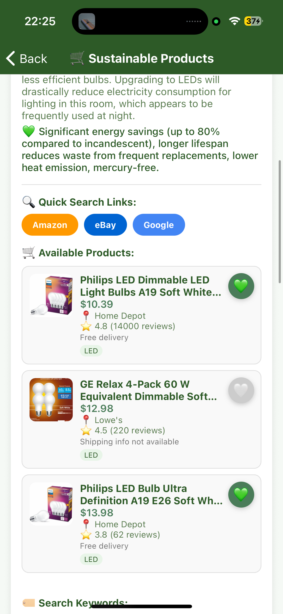
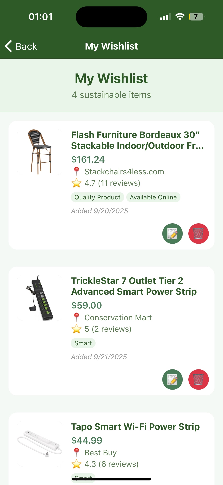
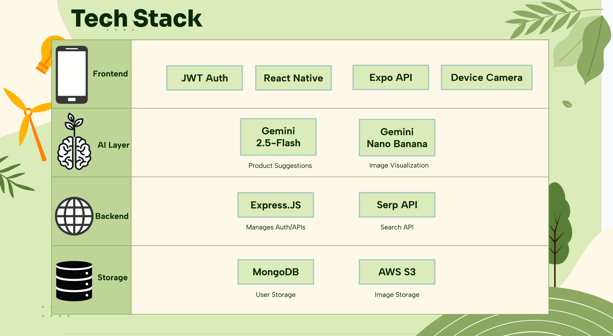

# SustainaView - AI-Powered Sustainable Room Makeover

**Turn any room into an eco-friendly space effortlessly, with a little help from AI.**

## App Screenshots

  
  
  

## Overview

SustainaView is a mobile app that makes sustainable interior design easy and fun. Just snap a photo of your room, and our AI will give you personalized, eco-friendly suggestions, show you what your space could look like after a green makeover, and even break down the costs for you. It’s like having a sustainability expert and designer in your pocket!

### **Project Members**
- **[Arjun Suryawanshi](https://github.com/arjunsur12)** - Frontend Development and UI/UX Design
- **[Chinmay Govind](https://github.com/chinmaygovind)** - Full-Stack Developer and AI Integration
- **[Akash Sarode](https://github.com/KashGiannis34)** - Backend Architecture and Database Design

---

## Motivation and Vision

In an era where climate consciousness meets technological innovation, SustainaView bridges the gap between environmental responsibility and accessible interior design. Our app empowers users to make informed, sustainable choices for their living spaces while providing:

- **Intelligent Analysis**: AI-powered room assessment and sustainability scoring
- **Cost-Effective Solutions**: Price comparisons across multiple vendors including local and second-hand options
- **Visual Transformation**: AI-generated before/after visualizations of sustainable makeovers
- **Community Sharing**: Save and share your eco-friendly transformations with friends
- **Actionable Insights**: Direct links to purchase recommended sustainable products

---

## Technologies Used

### **Frontend - Mobile Application**
- **React Native** - Cross-platform mobile development framework
- **Expo** - Development platform for universal React applications
- **React Navigation** - Seamless navigation between screens
- **Expo Camera** - Native camera integration for room photography
- **AsyncStorage** - Local data persistence and user session management
- **Custom Components** - Reusable UI components including ImageViewer with zoom functionality

### **Backend - API Server**
- **Node.js** - JavaScript runtime for server-side development
- **Express.js** - Web application framework for RESTful API development
- **JWT (JSON Web Tokens)** - Secure user authentication and authorization
- **bcrypt** - Password hashing and security
- **CORS** - Cross-origin resource sharing configuration

**How it works:**
- When you take a photo, the app securely uploads it to AWS S3. Each image gets a unique, private URL, and access is managed with signed URLs for security.
- User accounts, authentication tokens, and all wishlist information are stored in MongoDB Atlas. When you save a wishlist item, the app stores the product info and the S3 image URL in your user document, so your data is always linked to your account and available on any device you log in from.

### **Database and Storage**
- **MongoDB Atlas** - Cloud-hosted NoSQL database for user data and transformations
- **Mongoose** - MongoDB object modeling for Node.js
- **AWS S3** - Scalable cloud storage for room images
- **AWS SDK v3** - Modern AWS service integration with signed URLs
- **Sharp** - High-performance image processing and compression

**How it works:**
- When you snap a room photo, the app uploads it to AWS S3 and gets back a secure URL.
- This S3 URL is then saved in MongoDB, linked to your user profile and any wishlist or transformation you create.
- All your wishlist items, including product details and their associated S3 image URLs, are stored in MongoDB Atlas under your user account.
- User authentication (sign up, login, JWT tokens) is handled by the backend and stored securely in MongoDB, so your data is protected and only accessible to you.

### **AI and Machine Learning**
- **Google Gemini API** - Advanced AI for room analysis and product recommendations
- **Gemini Vision** - Computer vision for intelligent room assessment
- **Natural Language Processing** - Context-aware sustainability suggestions
- **Image Generation** - AI-powered visualization of sustainable transformations

### **External Integrations**
- **SerpAPI** - Real-time product search across multiple e-commerce platforms
- **Google Shopping** - Product price comparison and availability
- **Local Business APIs** - Integration with local and second-hand retailers

### **Development and Deployment**
- **Git** - Version control and collaborative development
- **npm** - Package management and dependency handling
- **Expo CLI** - Development server and build tools
- **VS Code** - Integrated development environment

---

## Competition Categories and Why We Deserve to Win

### **Primary Category: Sustainability**
**Why SustainaView Deserves This Award:**
- **Direct Environmental Impact**: Our app directly promotes sustainable consumption by making eco-friendly choices accessible and visually appealing
- **Measurable Results**: Users receive sustainability scores and potential environmental savings for each transformation
- **Behavioral Change**: By gamifying sustainable interior design, we encourage long-term eco-conscious decision making
- **Local Economy Support**: Integration with local and second-hand retailers reduces shipping emissions and supports community businesses
- **Educational Component**: Users learn about sustainable materials and their environmental benefits through detailed product analysis

### **Track: Best Use of AI**
**Our AI Integration Excellence:**
- **Multi-Modal AI Processing**: Combines computer vision for room analysis with natural language processing for recommendations
- **Contextual Intelligence**: AI understands room types, existing furniture, and user preferences to provide personalized suggestions
- **Dynamic Image Generation**: Creates realistic visualizations of sustainable transformations using advanced AI models
- **Intelligent Product Matching**: AI analyzes room aesthetics and suggests compatible eco-friendly alternatives
- **Continuous Learning**: System improves recommendations based on user interactions and preferences

### **Track: Best Use of Computer Vision**
**Computer Vision Innovation:**
- **Room Recognition**: Accurately identifies room types, furniture, and spatial layouts from single photos
- **Object Detection**: Recognizes individual furniture pieces, lighting, and decor elements
- **Sustainability Assessment**: Evaluates existing items for environmental impact and replacement opportunities
- **Spatial Analysis**: Understands room dimensions and flow for optimal sustainable design suggestions
- **Quality Processing**: Handles various lighting conditions and photo qualities for consistent analysis

### **Track: Best Design**
**Design Excellence:**
- **Intuitive User Experience**: Streamlined workflow from photo capture to transformation visualization
- **Beautiful UI/UX**: Clean, modern interface with smooth animations and responsive design
- **Accessibility First**: Designed for users of all technical skill levels with clear visual feedback
- **Cross-Platform Consistency**: Seamless experience across iOS and Android devices
- **Visual Storytelling**: Before/after comparisons and transformation galleries create engaging user journeys

### **MLH Prize: Best Use of Gemini API**
**Gemini API Mastery:**
- **Advanced Vision Processing**: Leverages Gemini's multimodal capabilities for comprehensive room analysis
- **Intelligent Recommendations**: Uses Gemini's reasoning capabilities to suggest contextually appropriate sustainable alternatives
- **Natural Conversations**: Integrates Gemini's language understanding for user-friendly explanations of sustainability benefits
- **Complex Queries**: Processes intricate requests combining visual analysis with product research and cost calculations
- **Scalable Integration**: Robust error handling and response processing for production-ready Gemini API usage

### **MLH Prize: Best Use of MongoDB Atlas**
**MongoDB Atlas Implementation:**
- **Scalable Architecture**: Efficient document-based storage for user profiles, transformations, and product data
- **Real-Time Sync**: Seamless data synchronization across user sessions and devices
- **Flexible Schema**: Adaptable data models supporting diverse room types and product categories
- **Performance Optimization**: Indexed queries and aggregation pipelines for fast data retrieval
- **Cloud-Native Design**: Leverages Atlas's managed infrastructure for reliability and automatic scaling
- **Security Integration**: Proper authentication workflows with encrypted data storage

---

## Key Features

### Core Functionality
- **Room Photography**: High-quality camera integration with guided photo capture
- **AI Analysis**: Comprehensive room assessment with sustainability scoring
- **Product Discovery**: Intelligent eco-friendly product recommendations
- **Visual Transformation**: AI-generated before/after room visualizations
- **Transformation Library**: Save and organize your sustainable makeover ideas
- **User Authentication**: Secure account management with JWT tokens

### Advanced Features
- **Cost Analysis**: Price comparisons across multiple retailers including local options
- **Environmental Impact**: Detailed sustainability metrics and potential savings
- **Cross-Platform**: Native mobile experience on both iOS and Android
- **Cloud Storage**: Secure image storage with AWS S3 and signed URLs
- **Real-Time Updates**: Dynamic product availability and pricing information

---

## What Makes SustainaView Special

1. **Holistic Approach**: Unlike simple product recommendation apps, we provide complete room transformation experiences
2. **Local Integration**: Supporting local businesses and second-hand markets for reduced environmental impact
3. **Visual Innovation**: AI-generated visualizations make sustainable choices tangible and exciting
4. **Educational Value**: Users learn about sustainable materials and their benefits through interactive experiences
5. **Community Focus**: Shareable transformations create a network of sustainability-minded individuals
6. **Actionable Results**: Direct purchasing links and cost breakdowns remove barriers to sustainable choices

---

## Impact and Future Vision

SustainaView represents more than just an app—it's a movement toward accessible, intelligent, and beautiful sustainable living. By combining cutting-edge AI with practical interior design solutions, we're making environmental consciousness both achievable and inspiring for everyone.

**Join us in transforming spaces, one room at a time. **

---

*Built with ❤️ for PennApps 2026*